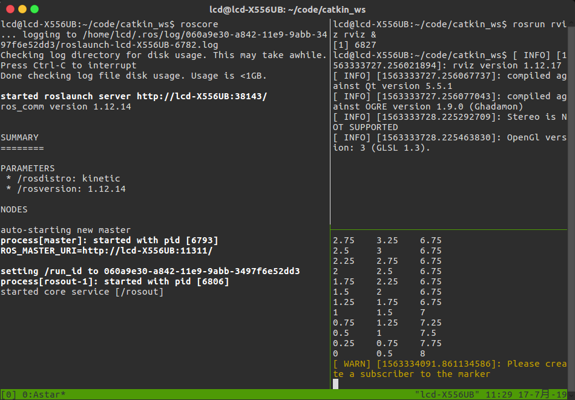

# Astar

## 实现步骤

- 从起点A开始，把它存入‘开启列表’，开启列表就是一个等待检查方格的列表；
- 寻找起点A周围可以到达的方格，将他们存入‘开启列表’，并设置他们的‘父方格’为A；
- 从‘开启列表’中删除起点A，并将其加入‘关闭列表’，‘关闭列表’中存放的都是不需要再次检查的方格；
- 从开启列表中选择F = G + H最小的点C，把它从‘开启列表’删除，加入‘关闭列表‘；
- 检查它所有到达的点，如果这些方格还不在’开启列表‘，将其加入，计算这些方格的G、H、F值，并设置他们’父方格‘为C；
- 如果某个相邻D已经在’开启列表‘里，检查如果用经过C到达它的话，G值是否会更低，如果新的G值更低，那就把它的’父方格‘改为C，然后从新计算FHG值，如果新的G值比较高，就说明经过C再到达D需要更远的路
- 重复进行搜索，直到’开启列表‘中出现目标方格。

## 效果图

